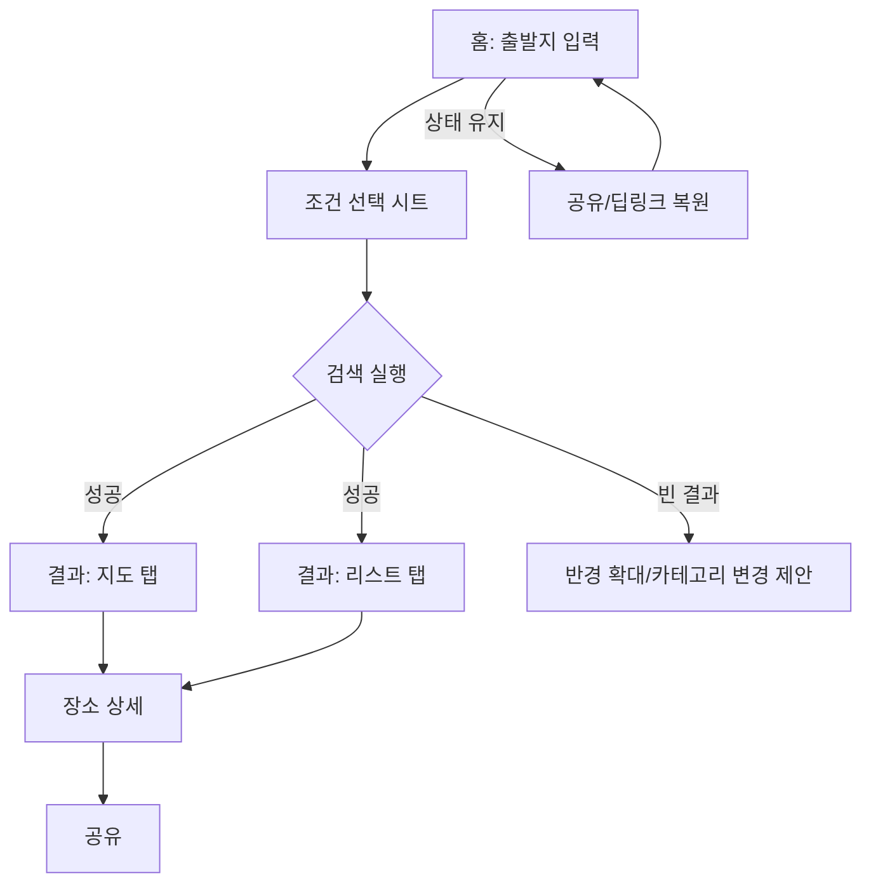

## 모임 중간 지점 찾기 — 화면 플로우 (출발지 우선)

```mermaid
flowchart TD
  A[홈: 출발지 입력] --> B[조건 선택 시트]
  A -->|상태 유지| D[공유/딥링크 복원]
  B --> C{검색 실행}
  C -->|성공| E[결과: 지도 탭]
  C -->|성공| F[결과: 리스트 탭]
  C -->|빈 결과| G[반경 확대/카테고리 변경 제안]
  E --> H[장소 상세]
  F --> H
  H --> I[공유]
  D --> A
```

- 주요 전환: A → B → C → E/F
- 출발지 우선: A에서 서울 지하철역 2곳 이상 입력 시 CTA 활성. B에서 카테고리/반경/교통수단 설정. 홈과 입력 화면에 조건 요약 표시
